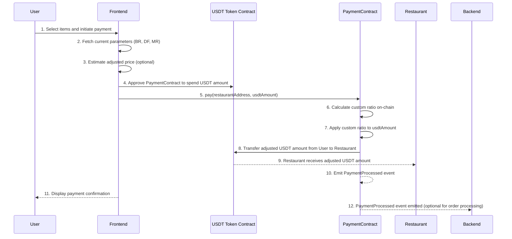

# **System Documentation**

---

## **System Overview**

### **Objective**

Develop a blockchain-based Point-of-Sale (PoS) system on the **Polygon** network that allows users to pay restaurants using USDT, with payments adjusted by a custom ratio calculated **on-chain** based on transaction volumes. The system ensures transparency, fair compensation to restaurants, and incentivizes user behavior without relying on off-chain services to update ratios.

### **Key Components**

- **PaymentContract**: A smart contract on Polygon that processes payments, calculates the custom ratio on-chain, and transfers adjusted amounts to restaurant wallets.
- **Backend Services**:
  - **Order Processing Backend**: Processes orders by mapping payments to orders, handling order fulfillment off-chain.
- **Frontend Application**: User interface for ordering, displaying adjusted prices, and facilitating payments.
- **Blockchain Transparency**: All payments and ratio calculations are recorded on-chain, ensuring transparency and trust.

---

## **Updated Sequence Diagram**



---

## **Subsystem Documentation**

### **1. Smart Contract**

#### **PaymentContract**

##### **Overview**

The `PaymentContract` handles payments from users to restaurants, calculates the custom ratio **on-chain** during each payment based on recent transaction volumes, and transfers the adjusted USDT amount to the restaurant's wallet.

##### **Key Features**

- **On-Chain Custom Ratio Calculation**: Calculates the custom ratio during each payment based on on-chain data.
- **Payment Processing**: Processes payments with adjusted amounts.
- **Data Storage**: Maintains transaction volumes per restaurant and overall.
- **Event Emission**: Emits `PaymentProcessed` events for transparency and optional off-chain order processing.

##### **Smart Contract Code**

```solidity
// SPDX-License-Identifier: MIT
pragma solidity ^0.8.17;

import "@openzeppelin/contracts/token/ERC20/utils/SafeERC20.sol";

contract PaymentContract {
    using SafeERC20 for IERC20;

    IERC20 public usdtToken;
    address public owner;

    // Base Ratio (BR), Decay Factor (DF), Minimum Ratio (MR)
    uint256 public baseRatio;    // e.g., 1 * 1e18 (1.00)
    uint256 public decayFactor;  // e.g., 0.5 * 1e18 (0.50)
    uint256 public minRatio;     // e.g., 0.90 * 1e18 (0.90)

    // Time window for transaction volumes (e.g., 1 hour)
    uint256 public timeWindow;   // In seconds, e.g., 3600 for 1 hour

    // Struct to store transaction volume data
    struct VolumeData {
        uint256 amount;
        uint256 timestamp;
    }

    // Mapping of restaurant address to their volume data
    mapping(address => VolumeData[]) public restaurantVolumes;

    // Total transaction volumes
    VolumeData[] public totalVolumes;

    event PaymentProcessed(
        address indexed user,
        address indexed restaurant,
        uint256 originalAmount,
        uint256 adjustedAmount,
        uint256 customRatio
    );

    constructor(
        address _usdtToken,
        uint256 _baseRatio,
        uint256 _decayFactor,
        uint256 _minRatio,
        uint256 _timeWindow
    ) {
        usdtToken = IERC20(_usdtToken);
        owner = msg.sender;
        baseRatio = _baseRatio;
        decayFactor = _decayFactor;
        minRatio = _minRatio;
        timeWindow = _timeWindow;
    }

    // Function to process payment
    function pay(address restaurant, uint256 usdtAmount) external {
        require(restaurant != address(0), "Invalid restaurant address");
        require(usdtAmount > 0, "Amount must be greater than zero");

        // Update transaction volumes
        _updateVolumes(restaurant, usdtAmount);

        // Calculate custom ratio
        uint256 customRatio = _calculateCustomRatio(restaurant);

        // Calculate adjusted amount
        uint256 adjustedAmount = (usdtAmount * customRatio) / 1e18;

        // Transfer USDT from user to restaurant
        usdtToken.safeTransferFrom(msg.sender, restaurant, adjustedAmount);

        emit PaymentProcessed(msg.sender, restaurant, usdtAmount, adjustedAmount, customRatio);
    }

    // Internal function to update transaction volumes
    function _updateVolumes(address restaurant, uint256 usdtAmount) internal {
        uint256 currentTime = block.timestamp;

        // Add restaurant volume data
        restaurantVolumes[restaurant].push(VolumeData({
            amount: usdtAmount,
            timestamp: currentTime
        }));

        // Add total volume data
        totalVolumes.push(VolumeData({
            amount: usdtAmount,
            timestamp: currentTime
        }));

        // Clean up old data outside the time window
        _cleanupOldData(restaurantVolumes[restaurant]);
        _cleanupOldData(totalVolumes);
    }

    // Internal function to clean up old volume data
    function _cleanupOldData(VolumeData[] storage volumes) internal {
        uint256 cutoffTime = block.timestamp - timeWindow;
        while (volumes.length > 0 && volumes[0].timestamp < cutoffTime) {
            // Remove the oldest entry
            for (uint256 i = 0; i < volumes.length - 1; i++) {
                volumes[i] = volumes[i + 1];
            }
            volumes.pop();
        }
    }

    // Internal function to calculate custom ratio
    function _calculateCustomRatio(address restaurant) internal view returns (uint256) {
        uint256 TT_a = _getTotalVolume(restaurantVolumes[restaurant]);
        uint256 TT_total = _getTotalVolume(totalVolumes);

        uint256 BR = baseRatio;
        uint256 DF = decayFactor;
        uint256 MR = minRatio;

        uint256 relativeShare = TT_total == 0 ? 0 : (TT_a * 1e18) / TT_total; // Scaled by 1e18
        uint256 decay = (relativeShare * DF * BR) / 1e36; // Adjust for scaling

        uint256 currentRatio = BR > decay ? BR - decay : 0;
        if (currentRatio < MR) {
            currentRatio = MR;
        }

        return currentRatio;
    }

    // Internal function to get total volume from an array of VolumeData
    function _getTotalVolume(VolumeData[] storage volumes) internal view returns (uint256) {
        uint256 total = 0;
        for (uint256 i = 0; i < volumes.length; i++) {
            total += volumes[i].amount;
        }
        return total;
    }
}
```

##### **Explanation**

- **On-Chain Data Storage**:
  - **VolumeData Struct**: Stores the amount and timestamp of each transaction.
  - **restaurantVolumes**: Mapping from restaurant addresses to arrays of their transaction volumes within the time window.
  - **totalVolumes**: Array of all transaction volumes across all restaurants within the time window.
- **Updating Volumes**:
  - During each payment, `_updateVolumes` adds the transaction to the respective arrays and cleans up old data outside the time window.
- **Calculating Custom Ratio**:
  - `_calculateCustomRatio` computes the ratio based on the recent transaction volumes.
  - **Relative Share**: Calculated as `(TT_a * 1e18) / TT_total` to maintain precision.
  - **Decay**: Calculated using the relative share, decay factor, and base ratio.
  - **Current Ratio**: Ensures it doesn't fall below the minimum ratio.
- **Payment Processing**:
  - Applies the custom ratio to the payment amount.
  - Transfers the adjusted amount to the restaurant.
- **Event Emission**:
  - Emits `PaymentProcessed` with the custom ratio used for transparency.

##### **Considerations**

- **Gas Costs**:
  - Storing and cleaning up arrays of `VolumeData` can be gas-intensive.
  - The number of transactions per hour should be considered to ensure feasibility.
- **Scalability**:
  - For high transaction volumes, alternative data structures or off-chain scaling solutions may be necessary.

### **2. Backend Services**

#### **Order Processing Backend**

##### **Overview**

Since the custom ratio calculation is now on-chain, the backend focuses on:

- Mapping payments to orders.
- Handling order processing and fulfillment.
- Providing data to the frontend for displaying adjusted prices.

##### **Workflow**

1. **Order Initiation**:
   - The frontend generates an order ID and sends order details to the backend.
   - The order is stored with a pending status.
2. **Payment Processing**:
   - After payment, the frontend can send the transaction hash to the backend.
   - The backend verifies the payment on-chain and matches it with the order.
3. **Order Confirmation**:
   - Once the payment is confirmed, the backend updates the order status and notifies the restaurant.
4. **Updates and Notifications**:
   - The backend provides order status updates to the frontend or directly to the user.

### **3. Frontend Application**

#### **Overview**

The frontend application provides users with:

- An interface to browse menus and select items.
- Displays estimated adjusted prices (since the exact custom ratio is calculated on-chain during payment).
- Facilitates payment through the smart contract.
- Receives order confirmations and updates.

#### **Workflow**

1. **Item Selection**:
   - Users select items to order.
2. **Price Estimation**:
   - Frontend fetches current parameters (BR, DF, MR) from the smart contract.
   - Estimates the adjusted price using available data (note: may not be exact).
3. **Order Initiation**:
   - Frontend sends order details to the backend.
4. **Payment Process**:
   - User approves USDT transfer to the `PaymentContract`.
   - Frontend calls the `pay` function on the smart contract.
5. **Payment Confirmation**:
   - Frontend displays payment confirmation.
6. **Order Status Updates**:
   - Frontend receives updates from the backend about the order status.

---

## **Custom Ratio Calculation Algorithm (On-Chain Implementation)**

### **Variables and Parameters**

- **Total Transactions per Restaurant (TTₐ)**: Sum of USDT amounts paid to a restaurant within the time window.
- **Total Transactions Across All Restaurants (TT_total)**: Sum of USDT amounts paid to all restaurants within the time window.
- **Base Ratio (BR)**: Default token-to-USDT value when a restaurant has minimal transaction volume.
- **Decay Factor (DF)**: Determines how much the ratio decreases as transaction volume increases.
- **Minimum Ratio (MR)**: Ensures the ratio doesn't fall below a certain value.
- **Time Window**: The period over which transaction volumes are considered (e.g., 1 hour).

### **Algorithm Steps**

1. **Update Transaction Volumes**:
   - On each payment, record the transaction amount and timestamp for both the restaurant and the total volumes.
   - Clean up old entries outside the time window.

2. **Calculate Relative Transaction Share**:
   - **Relative Share**: `relativeShare = (TT_a * 1e18) / TT_total` (scaled for precision).
   - If `TT_total` is zero, `relativeShare` is set to zero.

3. **Determine Current Ratio Based on Relative Share**:
   - **Decay**: `decay = (relativeShare * DF * BR) / 1e36` (adjusted for scaling).
   - **Current Ratio**: `currentRatio = BR - decay`.
   - Ensure `currentRatio` does not fall below `MR`.

4. **Apply Custom Ratio During Payment**:
   - Adjust the payment amount using the calculated `currentRatio`.

### **Advantages of On-Chain Calculation**

- **Transparency**: All calculations are on-chain and verifiable.
- **Eliminates Off-Chain Dependence**: No need for backend services to update ratios periodically.
- **Real-Time Adjustments**: Ratios are updated with each transaction, providing up-to-date incentives.

### **Challenges**

- **Gas Costs**: Managing dynamic arrays and frequent data updates may increase gas consumption.
- **Scalability**: High transaction volumes could lead to performance issues.

---

## **Security Considerations**

### **Smart Contract Security**

- **Gas Optimization**:
  - Consider alternative data structures (e.g., mappings with timestamps) to reduce gas costs.
  - Limit the number of volume entries by aggregating older transactions.
- **Access Control**:
  - Ensure only authorized addresses can perform sensitive operations (e.g., owner-only functions).
- **Integer Overflow/Underflow**:
  - Solidity ^0.8.17 has built-in checks, but careful coding practices are essential.

### **Data Integrity**

- **Timestamp Reliability**:
  - Be cautious of miners manipulating `block.timestamp` (though they can only adjust it slightly).
- **Reentrancy Protection**:
  - Although not present in the current functions, consider adding `ReentrancyGuard` if new functions are added that could be vulnerable.

---

## **Testing and Deployment**

### **Testing**

- **Unit Testing**:
  - Test the `_calculateCustomRatio` function with various scenarios.
  - Ensure that the `_cleanupOldData` function correctly removes outdated entries.
- **Integration Testing**:
  - Test the entire payment flow from frontend to smart contract and back to backend.
- **Gas Analysis**:
  - Analyze gas consumption for the `pay` function to ensure it's acceptable.

### **Deployment**

1. **Deploy Smart Contract**:
   - Deploy the `PaymentContract` on the **Polygon** network.
   - Verify the contract on Polygonscan.
2. **Configure Frontend and Backend**:
   - Update applications to interact with the new contract.
   - Ensure that the frontend fetches parameters (BR, DF, MR) from the contract.
3. **Monitoring**:
   - Monitor contract performance and gas usage.
   - Be prepared to optimize if necessary.


